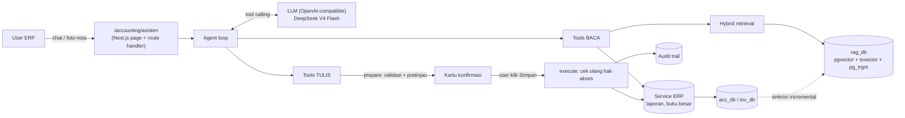
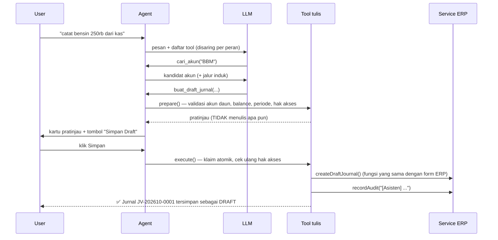

# RAG-BLS — Asisten AI untuk ERP Internal (Accounting & Inventaris)

> **TL;DR (EN):** A production-oriented RAG + tool-calling assistant embedded in an internal Next.js ERP.
> Users ask questions in Indonesian ("what's the balance of petty cash at end of September?") and can
> **create data by chatting** ("record a 250k fuel expense paid from petty cash today"). Answers come from
> the ERP's own services (never invented by the LLM), retrieval is hybrid (full-text + trigram + pgvector,
> fused with RRF), and every write goes through a **two-phase propose → human-confirm** flow with
> role checks and audit trail.

Studi kasus portofolio. Implementasi lengkap berada di repositori ERP (private); repo ini berisi
dokumentasi arsitektur, keputusan desain, dan pelajaran yang didapat. **Tidak ada data perusahaan,
kredensial, maupun data keuangan di repo ini.**

---

## Masalah

ERP internal (Next.js 16 + Prisma + PostgreSQL) dipakai tim keuangan untuk COA (~3.200 akun),
jurnal (~21.000 jurnal hasil migrasi dari Excel), laporan keuangan, dan inventaris aset.
Kendala sehari-hari:

- Mencari akun yang tepat sulit: banyak sub akun bernama sama (mis. *BIAYA BBM KENDARAAN*) di puluhan
  project/tim berbeda.
- Pertanyaan sederhana ("jurnal sewa gudang bulan lalu?", "saldo kas operasional per akhir bulan?")
  butuh beberapa kali klik dan filter.
- Input transaksi rutin (nota bensin, serah terima laptop) repetitif.

## Solusi

Halaman **Asisten AI** di dalam ERP:

| Kemampuan | Contoh |
|---|---|
| Tanya data | "Laba rugi September, 5 beban terbesar", "aset yang dipegang Dewi" |
| Cari dengan makna & toleran typo | "ongkos bahan bakar" → akun *BIAYA BBM*, "bensn" → *Bensin* |
| Input lewat chat | "catat biaya BBM 250 ribu hari ini dari kas" → kartu pratinjau → **Simpan Draft** |
| Foto nota | Upload foto → OCR → draft jurnal terisi |
| Panduan | "Siapa yang boleh posting jurnal?" |

## Arsitektur

Detail: [docs/arsitektur.md](docs/arsitektur.md) · Keputusan desain: [docs/keputusan-desain.md](docs/keputusan-desain.md)

### Komponen

| Komponen | Isi |
|---|---|
| **Index** | DB terpisah `rag_db` (Postgres + pgvector). Dokumen: akun (dengan jalur induk lengkap), jurnal (baris debit/kredit sebagai kalimat), aset, dan panduan pemakaian. |
| **Retrieval** | 3 jalur → *Reciprocal Rank Fusion*: full-text `simple` dengan prefix (bobot lebih untuk AND), trigram pada judul (typo), cosine pgvector (makna). |
| **Embedding** | `multilingual-e5-small` dijalankan lokal di Node (onnxruntime) — teks ERP tidak dikirim ke layanan embedding pihak ketiga. Bisa dimatikan (`keyword only`). |
| **LLM** | Klien OpenAI-compatible tipis (`fetch`), default DeepSeek V4 Flash; ganti provider lewat env. |
| **Tools baca (12)** | Pencarian pengetahuan, cari akun, daftar/detail jurnal, buku besar, laporan keuangan (neraca saldo, neraca, laba rugi, arus kas), ringkasan, item perlu verifikasi, cari/detail aset, master inventaris, audit log. |
| **Tools tulis (9)** | Draft jurnal (+opsi posting), posting, ubah draft, tambah akun COA, catat aset, serah terima, pengembalian, perbaikan, nonaktifkan aset. |
| **UI** | Chat dengan riwayat per user, render markdown aman (tanpa HTML mentah), kartu pratinjau dengan tabel debit/kredit, lampiran foto nota. |

## Alur tulis dua langkah (human-in-the-loop)

Prinsip yang dipegang:

1. **LLM tidak pernah menulis langsung.** Ia hanya mengusulkan; manusia yang menekan tombol.
2. **Aturan bisnis tidak diduplikasi.** Tools memanggil service ERP yang sama dengan form biasa,
   jadi validasi (akun induk ditolak, debit = kredit, periode tertutup) otomatis konsisten.
3. **Hak akses dicek dua kali** (saat usulan & saat eksekusi) memakai session user, bukan "keputusan" LLM.
   Tool yang tidak boleh dipakai sebuah peran bahkan tidak dikirim ke LLM.
4. **Angka resmi tidak diambil dari RAG.** Saldo & laporan selalu lewat fungsi laporan ERP, sehingga
   jawaban Asisten identik dengan halaman ERP (diverifikasi oleh test).

## Hasil

- Index ~24 ribu dokumen (akun + jurnal + panduan) dibangun dalam **±10 detik** (mode keyword);
  dokumen yang tidak berubah tidak di-embed ulang (hash konten).
- Sinkronisasi incremental: data yang masuk lewat form ERP biasa ikut ter-index ≤30 detik.
- **13 test integrasi** dengan LLM tiruan terhadap database berisi data nyata hasil migrasi:
  alur konfirmasi, penolakan hak akses, klik ganda, akun induk, jurnal tidak seimbang,
  angka buku besar = service ERP, validitas riwayat tool-call.
- Uji end-to-end di browser (Playwright) dengan server LLM tiruan: tanya ringkasan → input jurnal →
  Simpan → riwayat tetap setelah reload; akses user Inventaris-only.

## Pelajaran

Ringkasnya (detail di [docs/keputusan-desain.md](docs/keputusan-desain.md)):

- **Nama akun duplikat** → dokumen akun wajib memuat jalur induk lengkap, dan prompt menyuruh LLM
  bertanya bila kandidat ambigu.
- **Kursor sinkronisasi** berbasis `updatedAt` saja melewatkan baris ber-timestamp sama → pakai
  pasangan `(updatedAt, id)`.
- **Paginasi index penuh** sempat mencampur urutan `updatedAt` dan kursor `id` → hanya 2.088 dari
  21.014 jurnal ter-index. Ketahuan karena menghitung jumlah dokumen per sumber setelah reindex.
- **Full-text OR** membuat "kas ho" cocok ke "kasbon" → tambah jalur AND berbobot lebih tinggi.
- **Riwayat tool-call** harus disanitasi: tool_calls tanpa jawaban lengkap (proses terhenti)
  membuat API menolak seluruh percakapan.

## Teknologi

Next.js 16 (App Router, route handler, server actions) · React 19 · TypeScript · Prisma 7 ·
PostgreSQL 16 · pgvector · pg_trgm · transformers.js (onnxruntime) · Zod 4 (skema tool → JSON Schema) ·
DeepSeek API (OpenAI-compatible) · node:test · Playwright

## Peta jalan

- Streaming jawaban (SSE) untuk respons yang terasa lebih cepat.
- Evaluasi retrieval dengan set pertanyaan nyata dari tim (recall@k per jenis pertanyaan).
- Rate limit terdistribusi (saat ini in-memory per proses).
- Re-ranker ringan untuk hasil pencarian akun.
