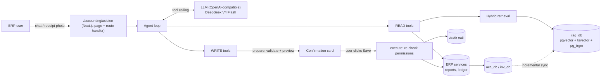
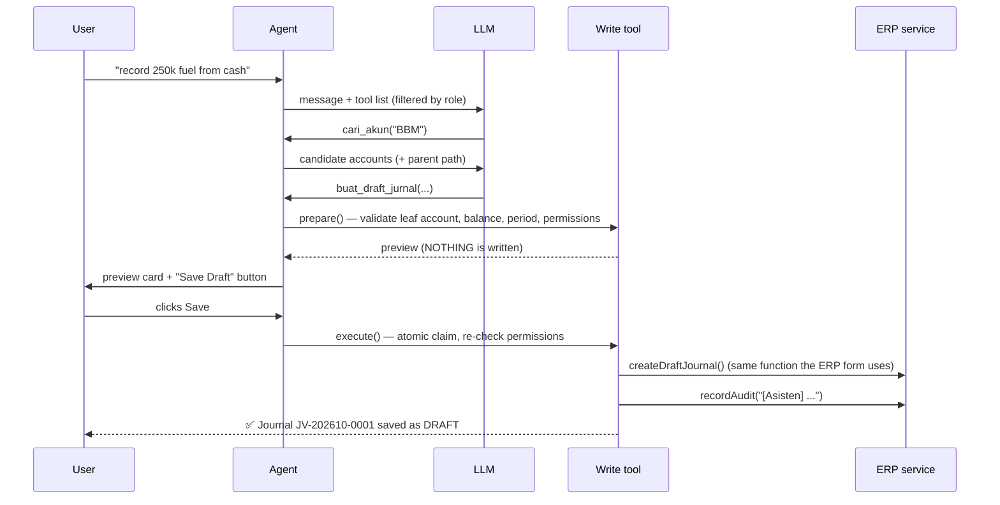

# RAG-BLS — AI Assistant for an Internal ERP (Accounting & Inventory)

> **TL;DR:** A production-oriented RAG + tool-calling assistant embedded in an internal Next.js ERP.
> Users ask questions in Indonesian ("what's the petty cash balance at the end of September?") and can
> **create data by chatting** ("record a 250k fuel expense paid from petty cash today"). Answers come from
> the ERP's own services (never invented by the LLM), retrieval is hybrid (full-text + trigram + pgvector,
> fused with RRF), and every write goes through a **two-phase propose → human-confirm** flow with
> role checks and an audit trail.

This is a portfolio case study. The full implementation lives in the (private) ERP repository; this repo
contains the architecture documentation, design decisions, and lessons learned. **No company data,
credentials, or financial data are included in this repo.**

---

## The problem

An internal ERP (Next.js 16 + Prisma + PostgreSQL) is used by the finance team for the chart of accounts
(~3,200 accounts), journal entries (~21,000 entries migrated from Excel), financial reports, and asset
inventory. Day-to-day pain points:

- Finding the right account is hard: many sub-accounts share the same name (e.g. *VEHICLE FUEL EXPENSE*)
  across dozens of different projects/teams.
- Simple questions ("warehouse rent journals last month?", "operating cash balance at month end?")
  take several clicks and filters.
- Routine data entry (fuel receipts, laptop hand-overs) is repetitive.

## The solution

An **AI Assistant** page inside the ERP:

| Capability | Example |
|---|---|
| Ask about data | "September P&L, top 5 expenses", "assets held by Dewi" |
| Semantic, typo-tolerant search | "fuel costs" → *BIAYA BBM* account, "bensn" → *Bensin* |
| Data entry by chat | "record a 250k fuel expense today from cash" → preview card → **Save Draft** |
| Receipt photos | Upload a photo → OCR → pre-filled draft journal |
| How-to guidance | "Who is allowed to post journals?" |

## Architecture

Details: [docs/architecture.md](docs/architecture.md) · Design decisions: [docs/design-decisions.md](docs/design-decisions.md)

### Components

| Component | Description |
|---|---|
| **Index** | A separate `rag_db` database (Postgres + pgvector). Documents: accounts (with their full parent path), journal entries (debit/credit lines written as sentences), assets, and the ERP user guide. |
| **Retrieval** | 3 paths → *Reciprocal Rank Fusion*: `simple` full-text with prefix matching (AND weighted higher than OR), trigram on titles (typos), pgvector cosine (meaning). |
| **Embeddings** | `multilingual-e5-small` runs locally in Node (onnxruntime), so ERP text is never sent to a third-party embedding service. Can be disabled (keyword-only mode). |
| **LLM** | A thin OpenAI-compatible client (`fetch`), DeepSeek V4 Flash by default; switch providers via env vars. |
| **Read tools (12)** | Knowledge search, account search, journal list/detail, general ledger, financial reports (trial balance, balance sheet, P&L, cash flow), summary, items needing verification, asset search/detail, inventory master data, audit log. |
| **Write tools (9)** | Draft journal (optionally post), post journal, edit draft, add chart-of-accounts entry, register asset, hand over, return, send to repair, retire asset. |
| **UI** | Chat with per-user history, safe markdown rendering (no raw HTML), preview cards with a debit/credit table, receipt photo attachments. |

## Two-phase write flow (human-in-the-loop)

Guiding principles:

1. **The LLM never writes directly.** It only proposes; a human presses the button.
2. **Business rules are not duplicated.** Tools call the same ERP services as the regular forms, so
   validation (parent accounts rejected, debit = credit, closed periods) stays consistent automatically.
3. **Permissions are checked twice** (at proposal and at execution) using the user's session, not the
   LLM's "decision". Tools a role may not use are never even sent to the LLM.
4. **Official figures never come from RAG.** Balances and reports always go through the ERP's reporting
   functions, so the assistant's answers match the ERP pages exactly (verified by tests).

## Results

- An index of ~24k documents (accounts + journals + guide) builds in **~10 seconds** (keyword mode);
  unchanged documents are not re-embedded (content hash).
- Incremental sync: data entered through regular ERP forms is indexed within ≤30 seconds.
- **13 integration tests** using a mock LLM against a database of real migrated data:
  confirmation flow, permission denials, double clicks, parent accounts, unbalanced journals,
  ledger figures = ERP service, tool-call history validity.
- End-to-end browser tests (Playwright) with a mock LLM server: ask for a summary → enter a journal →
  Save → history persists after reload; access for inventory-only users.

## Lessons learned

In short (details in [docs/design-decisions.md](docs/design-decisions.md)):

- **Duplicate account names** → account documents must include the full parent path, and the prompt
  tells the LLM to ask when candidates are ambiguous.
- A **sync cursor** based on `updatedAt` alone skips rows with identical timestamps → use the pair
  `(updatedAt, id)`.
- **Full-reindex pagination** once mixed `updatedAt` ordering with an `id` cursor → only 2,088 of 21,014
  journals were indexed. Caught by counting documents per source after reindexing.
- **OR full-text** made "kas ho" match "kasbon" → added an AND path with a higher weight.
- **Tool-call history** must be sanitized: tool_calls without complete answers (process died mid-turn)
  cause the API to reject the whole conversation.

## Tech stack

Next.js 16 (App Router, route handlers, server actions) · React 19 · TypeScript · Prisma 7 ·
PostgreSQL 16 · pgvector · pg_trgm · transformers.js (onnxruntime) · Zod 4 (tool schemas → JSON Schema) ·
DeepSeek API (OpenAI-compatible) · node:test · Playwright

## Roadmap

- Streaming answers (SSE) for a snappier feel.
- Retrieval evaluation with real questions from the team (recall@k per question type).
- Distributed rate limiting (currently in-memory per process).
- A lightweight re-ranker for account search results.
